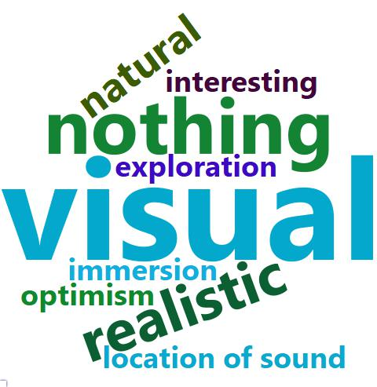
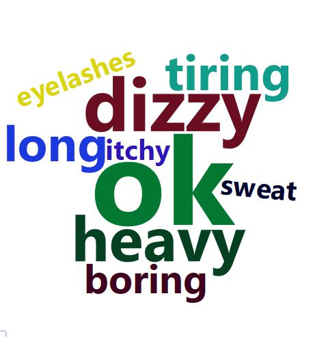

[ohavlicek@gmail.com](mailto:ohavlicek@gmail.com) 06/2018 - 11/2018

```{r setup, echo=FALSE, include=FALSE, message=FALSE}
# set this option in the first code chunk in the document
#knitr::opts_chunk$set(echo = params$printcode, warnings = params$printwarnings, messages = params$printmsg)  # knit with params gives error
knitr::opts_chunk$set(echo = FALSE, warnings = FALSE, messages = FALSE)
```

```{r libraries, message=FALSE}
library(tidyverse)
library(stringr)
library(forcats)
library(wordcloud2)
library(htmlwidgets)
library(webshot)
#webshot::install_phantomjs()
```

```{r define constants, message=FALSE}
questInputPath <- file.path(getwd(), "Data", "questionnaires_qualitative.xlsx")

```

```{r read data, message=FALSE}
QQ <- readxl::read_xlsx(questInputPath)
```


Questionnaires were completed by **43 participants**.

The questionnaire intro reads: "We are interested in your subjective, personal experiences and feelings about what you experienced in the virtual reality. You can try to close your eyes and recall what it was like. When describing your experiences write anything that comes to your mind, you may use metaphores, vague formulations etc. It is not important whether it makes clear sense, we are interested in everything!:-)"

# Experiences regarding causing tone by active button pressing or by (passive) vibration of controller
There were several questions:

* First, open-ended one: "How did you feel about the tone, when it was caused (I.) by your button press compared to when (II.) it sounded automatically after the vibration? Try to describe it in as much details as possible. Write anything that comes to your mind."
* Second, with more explict questions: "Now try to think whether you had some of these feeling or some other: For example, did you like the tone more after I. or II.? Did you feel that the tone is more under your control or that you are more responsible for it after I. or II.? Did it seem to you e.g. that there was someone else (human or AI) who caused the tones after II.?"
* Third, again asking explicitly: "Did you prefer situations with the button (I.) or vibrations (II.)? Why? Try to describe it at least a bit."

## In an open-ended question, do people describe what it was like in terms of task (difficulty, accuracy..) or phenomenal experiences (pleasant, smooth..)?

Coding distinguishes two degrees: Clear and Semi, although it was not always easy to code. Examples (some of which were coded in more categories):

* Task - clear: "It was easier for me to determine time interval after vibration"
* Task - Semi: "... I was more focused to what I had to listen for ... I was better able to replay the rhythm ..."
* Phenomenal - clear: "The tone was stressful ... it was more pleasant when I could cause it myself.", ".. tone after vibration sounded softer than after button press."
* Phenomenal - Semi: ".. I always had the feeling that I hear the tone sooner [after button press compared to vibration]"

```{r Task vs phenomenal, message=FALSE}
#table(QQ$PVO_Task_descr)
#table(QQ$PVO_Phenom_descr)
qqpvDescr <- QQ %>% select(Subject, PVO_Task_descr, PVO_Phenom_descr) %>% 
  gather(key="DescriptionType", value="DescriptionValue", PVO_Task_descr, PVO_Phenom_descr) %>%
  mutate(DescriptionType = recode(DescriptionType, `PVO_Task_descr` = "Task", `PVO_Phenom_descr` = "Phenomenal")) %>%
  mutate(DescriptionValue = recode(DescriptionValue, `1.0` = "Clear", `0.5` = "Semi")) %>%
  filter(complete.cases(.)) #%>%
  #unite(col="Description", DescriptionType, DescriptionValue, sep = "-")

#qqpvDescr %>% ggplot(., aes(x=Description, fill=Description)) + geom_bar()
qqpvDescr %>% ggplot(., aes(x=DescriptionType, fill=fct_rev(DescriptionValue))) + geom_bar(position="stack") + scale_fill_discrete(name="Description degree")
```

Even when emphasizing the phenomenal aspect in the questions, people still more often provided descriptions focusing on what was their task, how easy it was to estimate the intervals. I saw this a lot in questionnaires after a previous experiment where I held and pressed other people's hands and they often focused on the task in their descriptions. (My hypothesis is that people either do not experience much (if any) phenomenal experience of agency per se or it is not something they pay attention to, consider important. Descriptions in terms of control may be post-hoc reflections, beliefs, rather than experiences occuring during the actions.)

Only some people mentioned phenomenal aspects relating to agency, to having control over outcomes (but not to feeling free, causally efficacious etc): 

* "When I chose when the tone would sound, I felt I had the _situation better under control_, it was more pleasant, such a situation was more under control, more fluent, I could take a rest from the counting for a moment, get ready for when it is again needed to think about the number of milliseconds."
* ".. I felt better when I _controlled_ the beep myself."
* "I had the tone after button press more _under control_ and knew when it would come ..."
* "In the press-beep mode I had a feeling I had it more _under control_ ..."
* ".. when the tone sounded _without my contribution_ after vibration, it was more pleasant."
* "With I. [button press] one _has control_ over when he presses the button and focuses more-is prepared."

## In an open-ended question, do people spontaneously express preference for Press or Vibration trials?
This preference can be related to both task (what was easier..) and phenomenal aspects (what was more pleasant..) and is a bit more clear to code.

```{r Prefer Press or Vibr, message=FALSE}
#table(QQ$PVO_Press_better)
#table(QQ$PVO_Vibration_better)
qqpvPref <- QQ %>% select(Subject, PVO_Press_better, PVO_Vibration_better) %>% 
  gather(key="PreferenceType", value="PreferenceValue", PVO_Press_better, PVO_Vibration_better) %>%
  mutate(PreferenceType = recode(PreferenceType, `PVO_Press_better` = "Press", `PVO_Vibration_better` = "Vibration")) %>%
  mutate(PreferenceValue = recode(PreferenceValue, `1.0` = "Clear", `0.5` = "Semi")) %>%
  filter(complete.cases(.)) #%>%
  #unite(col="Description", DescriptionType, DescriptionValue, sep = "-")

#qqpvp %>% ggplot(., aes(x=Description, fill=Description)) + geom_bar()
qqpvPref %>% ggplot(., aes(x=PreferenceType, fill=fct_rev(PreferenceValue))) + geom_bar(position="stack") + scale_fill_discrete(name="Preference degree")
```

It is not completely informative, because it lacks information in what way they prefered which, but what I find interesting are the individual difference - some people reported "definitely vibration", some "definitely press", some participants (only a few) are counted in both categories.

## Combining open-ended question with direct question about preference of Press vs. Vibration related to Task or Phenomenal aspect:

```{r Prefer Press or Vibration from Task or Phenom perspective}
#table(QQ$PVO_Task_pref)
qqpvPrefAspect <- QQ %>% select(Subject, PVO_Task_pref, PVO_Phenom_pref) %>% 
  gather(key="PreferenceType", value="PreferenceValue", PVO_Task_pref, PVO_Phenom_pref) %>%
  mutate(PreferenceType = recode(PreferenceType, `PVO_Task_pref` = "Task", `PVO_Phenom_pref` = "Phenomenal")) %>%
  filter(complete.cases(.)) 

qqpvPrefAspect %>% ggplot(., aes(x=PreferenceType, fill=PreferenceValue)) + geom_bar(position=position_dodge(preserve = "single"))
```

Most people preferred button pressing with respect to something that could be described as phenomenal aspect, usually described in terms of pleasantness or control. Related to the task aspects (difficulty of time estimation), there was interesting heterogeneity among participants, but more seemed to prefer vibration trials a bit more often, perhaps because they could use just one modality of hearing for the estimation and could replay the auditory interval in their mind and also because the three vibrations set some "pace", measure of time.

## Additional aspects of Press vs Vibration from the question asking explicitly about these aspects

**Did they _like the tone itself_ more or differently after Press or after Vibration?**
```{r Liked tone}
as.data.frame(table(LikeToneAfter=QQ$PVE_Liked_tone))
```
Again interesting heterogeneity.

**Did they _feel in control_ more or differently after Press or after Vibration?**
```{r Felt in control}
as.data.frame(table(FeelInControlAfter=QQ$PVE_In_control))
```
When asked explicitly, Press is a clear winner, but still mentioned only by 11 out of 43 participants.

**Did they _feel responsible for tone_ more or differently after Press or after Vibration?**
```{r Felt responsible}
as.data.frame(table(ResponsibleAfter=QQ$PVE_Responsible_for_tone))
```
Very few people caught on this aspect of the open-ended question.

**Did they feel _involvement of other agent/AI_?**
```{r Other agent}
as.data.frame(table(OtherAgent=QQ$PVE_Other_agent))
```
When answered, most people did not feel the passively caused tones after vibration were produced by other agent or AI. Interesting is one participant who reported not connecting active button presses with own identity, sounds a bit schizoid.

**Some other comments regarding difference between Press and Vibration**
```{r Other notes Press vs Vibration}
cat(filter(QQ, !is.na(PVE_Notes))$PVE_Notes, sep="\n")
```

# Experiences regarding differences between the 2D and 3D scene types

There were several questions related to differences between scene types:


## Themes appearing in answers to open-ended question on tones in 2D vs 3D scenes

_"How did you feel about the tones sounding in 2D and 3D scenes? Again, please write anything that comes to your mind, in as much detail as you want."_

**`r table(QQ$SO_Any_diff)[[1]]`** out of the **`r nrow(QQ)`** people who completed questionnaire explicitly mentioned not seeing any difference between the tones.

In this question, more people used formulations in terms of phenomenal properties, rather than how it influenced task performance, perhaps because the question was phrased in this way, as being about "feeling" about the tones, but despite that, not that many people from the whole sample reported some such phenomenal aspects:

```{r SceneType_openQ_task_vs_phenom}
qqsceneDescr <- QQ %>% select(Subject, SO_Task_descr, SO_Phenom_descr) %>% 
  gather(key="DescriptionType", value="DescriptionValue", SO_Task_descr, SO_Phenom_descr) %>%
  mutate(DescriptionType = recode(DescriptionType, `SO_Task_descr` = "Task", `SO_Phenom_descr` = "Phenomenal")) %>%
  mutate(DescriptionValue = recode(DescriptionValue, `1.0` = "Clear", `0.5` = "Semi")) %>%
  filter(complete.cases(.)) #%>%
  #unite(col="Description", DescriptionType, DescriptionValue, sep = "-")

qqsceneDescr %>% ggplot(., aes(x=DescriptionType, fill=fct_rev(DescriptionValue))) + geom_bar(position="stack") + scale_fill_discrete(name="Description degree")
```

Regarding the phenomenal aspects, people mostly focused on feeling simply _better_ in the 3D condition. Numbers of people who expressed preference for 3D and for 2D condition with respect to phenomenal aspects, mostly liking it better:

```{r}
as.data.frame(table(SceneType_openQ_phenom_preference = QQ$SO_Phenom_pref))
```

There were only very few people who spontaneously expressed preference for 3D and 2D condition with respect to task aspects, usually being better able to count objects:

```{r}
as.data.frame(table(SceneType_openQ_task_preference = QQ$SO_Task_pref))
```

Sometimes participants wrote something a bit more interesting, again quite rarely, paraphrased by me:

```{r Other notes 2D vs 3D}
cat(filter(QQ, !is.na(SO_Notes))$SO_Notes, sep="\n")
```


## Asking about differences b/w tones in 2D and 3D more explicitly

_"Now try to think whether you liked the tones more in 2D or 3D scenes, whether for example in some scenes the tones sounded more naturally, whether you felt more responsible for the tones or had any other experiences. Did it seem to you that the tones came from some specific location in the 3D and 2D scenes?"_

Few times people repeated what they expressed spontanously in the previous open-ended question, whether they liked the tones more in 2D or 3D.

Regarding differences in perceived responsibility for the tones, there was perhaps only one report that was somehow interesting, few other reports can be coded as "The responsibility was same" or "I felt nothing, no special responsibility":

```{r}
cat(filter(QQ, !is.na(SE_Responsible))$SE_Responsible, sep="\n")
```

Otherwise although this responsibility aspect was explicitly mentioned in the question, no-one else caught on it.

More people caught on the location aspect of the tone, and in general how the tones seemed to them:

```{r}
as.data.frame(table(SceneType_explicit_sound_aspects = QQ$SE_Sound))
```

Although most people reported perceiving no tone-related difference between the 2D and 3D scenes, those who did reinforce what we know about people mapping perceived source of sound to space. E.g. in movie theaters, sound comes from speakers on the sides, but we perceive it as coming from the screen.


## Asking open-ended question about general 2D vs. 3D differences

Previous two questions asked about differences between scene types with respect to the **tones**. Now they were asked about differences between the 2D and 3D situations more in general:

_"Which differences between the 2D and 3D scenes did you notice? For example, how the scene changed as a result of your movement, differences in colorfulness, size of objects, etc."_

Here the themes in the answers were sometimes quite interesting:

```{r}
scene_dif_themes <- unlist(str_split(QQ$S_Diff, ", "))

df_scene_dif_themes <- as.data.frame(table(Scene_difference_themes = scene_dif_themes)) %>% arrange(desc(Freq))

wc_scene_dif = wordcloud2(df_scene_dif_themes %>% mutate(Freq = sqrt(Freq)))

saveWidget(wc_scene_dif,"wc_scene_dif.html",selfcontained = F)
webshot("wc_scene_dif.html","wc_scene_dif.jpeg", delay = 4, vwidth = 480, vheight=480)
```



More specifically:

```{r}
print(df_scene_dif_themes)
```

- **visual**: answers concerned e.g. colors, sharpness, shadows
- **composition**: differences in sizes and distances of objects between 2D and 3D, something we tried to minimize, but is impossible to eliminate
- **spatiality**: having the ability to look at objects from sides, perception of depth, perspective
- **nothing**: when explicitly mentioned seeing no difference between 2D and 3D, which is strange but means we managed to design the two conditions to be very close
- **realistic**: 3D seemed realistic
- **natural**: 3D seemed more natural
- **interesting**: 3D scenes generally more interesting
- **exploration**, **immersion**, **location of sound**: one participant spontaneously mentioned these themes, which were a bit hard to code, it was the richest description: "2D - flatness, less engaging due to inability to move the scene (tilting head, looking behind object..), one is looking at a picture. 3D - immersion into the room, 3D space seemingly includes into itself not just the person but also the sound, one is now looking at a changeable space, not a mere picture."
- **optimism**: one person wrote, switching to uppercase: "3D SCENES FELT SOMEHOW MORE OPTIMISTIC and pleasant"


## Asking about scene type preference explicitly

_"Did you prefer situations in 2D or 3D? Why? Try to describe it at least a bit."_

People did not reveal any interesting reasons for the preferences, usually only that 3D was more natural. But at least asked so explicitly everyone gave a preference. Interestingly some prefered 2D, one even mentioned it as more realistic:

```{r}
as.data.frame(table(SceneType_general_preference = QQ$SE_Pref)) %>% arrange(desc(Freq))
```


# Other questions

## Comfort

_"Did you feel uncomfortable during the experiment or after it, were you dizzy etc?"_


```{r}
comfort <- unlist(str_split(QQ$Uncomfortable_code, ", "))

df_comfort <- as.data.frame(table(comfort)) %>% arrange(desc(Freq))

wc_comfort = wordcloud2(df_comfort %>% mutate(Freq = sqrt(Freq)))

saveWidget(wc_comfort,"wc_comfort.html",selfcontained = F)
webshot("wc_comfort.html","wc_comfort.jpeg", delay = 4, vwidth = 480, vheight=480)
```



## Difficulties of perception

_"Did you sometimes have problems seeing objects on the table or other things in the virtual reality, hear the tones, feel vibrations of the controller? Was it rather in 2D or 3D, etc.?"_

I did not code this, but people reported usually having no problems, sometimes objects overlapping in 2D and several people reported the controller in Control condition sometimes vibrated not 3x by only 2x or even 1x.

## Difficulty of object counting

_"How difficult was it to count the objects? (1 = Totally easy, 7 = Totally difficult)"_

```{r}
QQ$ObjectsCount_Difficulty_num <- as.integer(str_extract(QQ$ObjectsCount_Difficulty, "\\d"))

boxplot(QQ$ObjectsCount_Difficulty_num, horizontal=TRUE)
```

Not very difficult.

## Difficulty of interval estimation

_"How difficult was it to estimate the time intervals? (1 = Totally easy, 7 = Totally difficult)"_

```{r}
QQ$Intervals_Difficulty_num <- as.integer(str_extract(QQ$Intervals_Difficulty, "\\d"))

boxplot(QQ$Intervals_Difficulty_num, horizontal=TRUE)
```

Somewhat difficult.

## Certainty of interval estimation

_"How certain were you with your time estimates? (1 = Not at all, I was only guessing, 7 = I think my estimates were always very close to reality)"_

```{r}
QQ$Intervals_Certainty_num <- as.integer(str_extract(QQ$Intervals_Certainty, "\\d"))

boxplot(QQ$Intervals_Certainty_num, horizontal=TRUE)
```

People were medium confident.

It could be interesting to see how this confidence corresponded with reality. It did, to some degree, see Analysis part 2.

## Guessing purpose of experiment

_"What do you think was the purpose of this experiment?"_

Most people reported something about perception of time in virtual reality, investigation of computer games etc.

Only two people reported something related to agency:
- "To evaluate how time passes in situations, which I control (at least partially) compared to those, where I am a passive participant in the events."
- "One's control over time reality."


## Asking about actual hypothesis

After giving people chance to express spontaneously whether they felt different control in 2D or 3D or whether the scene type or control type influenced their time estimations, I asked them explicitly:

_"Do you think that you generally had different time estimates in 2D or 3D situations or in situations with the button (Press-Beep) or with vibration (Vibration-Beep)? Why?"_

Some people reported already in previous questions perceiving the intervals between vibration and beep as being longer. This may be a real fact actually, or artifact, maybe the intervals after vibration were delayed somewhat; also people may have estimated the interval from first, not last of the three vibrations in a row.

"Different time estimates" in this question were generally answered in terms of being more or less precise/accurate, rather than under/overestimating.

Most people reported perceived differences between Action (press) and Control (vibration). They often thought vibration was more precise. Many people reported having trouble judging from when to count the intervals when pressing the button: when starting to press or when already pressed. Some people reported trouble in judging onset of interval in vibration. In behavioral data, accuracy (mean error) was better in Action, but precision (SD of errors) was slightly better in Control.

**Reported differences with respect to scene type**

```{r interval diff for scene type}
as.data.frame(table(Interval_differences_scene_type = QQ$S_int_scene)) %>% arrange(desc(Freq))
```

Most people did not answer this aspect of the question. Scene type did not seem important for the task at hand.

**Reported differences with respect to event type**

```{r interval diff for event type}
as.data.frame(table(Interval_differences_event_type = QQ$S_int_event)) %>% arrange(desc(Freq))
```

**Other reports**

People who did not describe differences in scene or event types reported something like "I don't think there were any differences" or "I don't know about any differences, I did not pay attention to this"

```{r interval diff nothing}
as.data.frame(table(Interval_differences_other = QQ$S_int_notes)) %>% arrange(desc(Freq))
```

---

Overall, people seem to care about task performance, rather than fact or experience of agency. People did not seem to see much relation between scene type agency or time intervals. Sense of agency for scenes does not seem to be part of our ontology, our lived (attended) and shared (communicable) experience.


